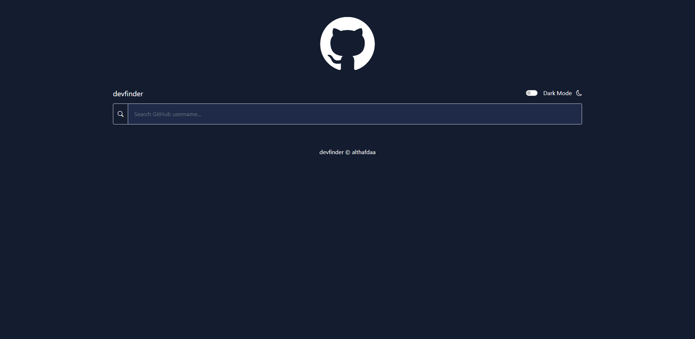

## Overview

First personal project that i used make with public API (github API)

### Screenshot

DESKTOP VIEW


### Links

- Live Site URL: []

## My process

### Built with

- Semantic HTML5 markup
- Bootstrap 5
- GitHub API
- Modern Vanilla Javascript(classes, cosntructor, asyncawait, arrow function)

### What I learned

As it is my first time doing project with public API, the authentication to get permission from github itself is pretty hard for me. Apperently github only give certain amount of time i think before it expires (error 403 permission denied) if you dont get the authenthication right.

```javascript
class GitHub {
  constructor() {
    this.client_id = "83cfc15420f80a2289e2";
    this.client_secret = "53c940c3983192cf7bed7313b9f8e3dfe5ac7a93";
  }
```

took me quite sometimes to apply my client id and secret to my apps

### Continued development

I will add light-theme/light mode that will activate with toggle

## Author

- Althafdaa
